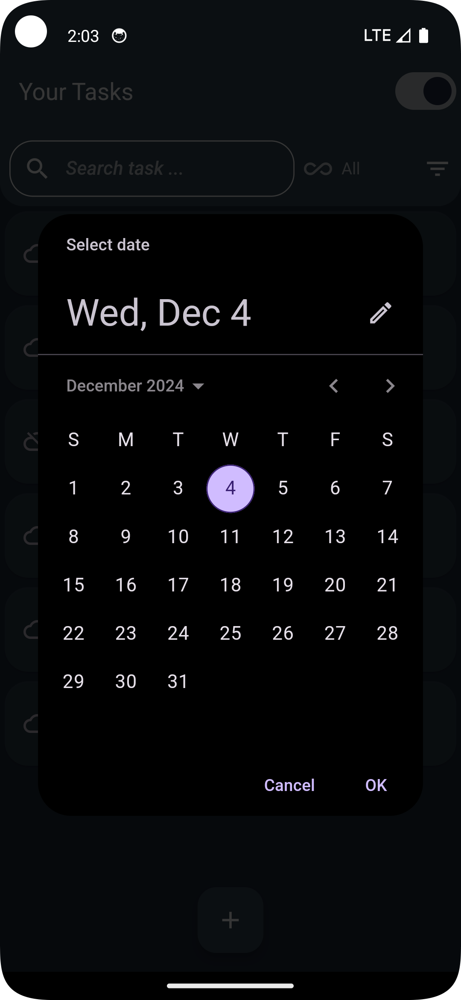
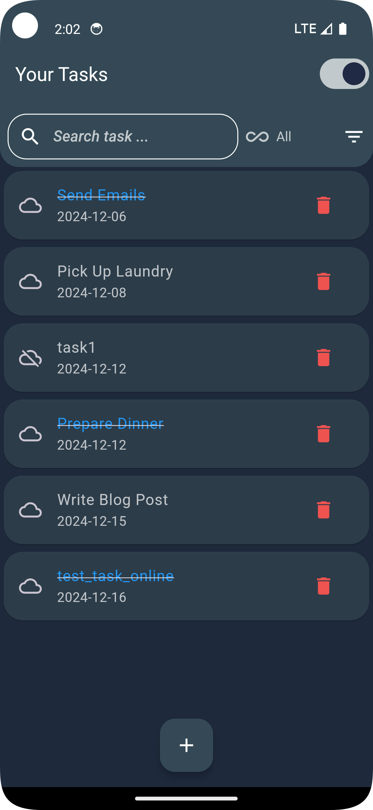
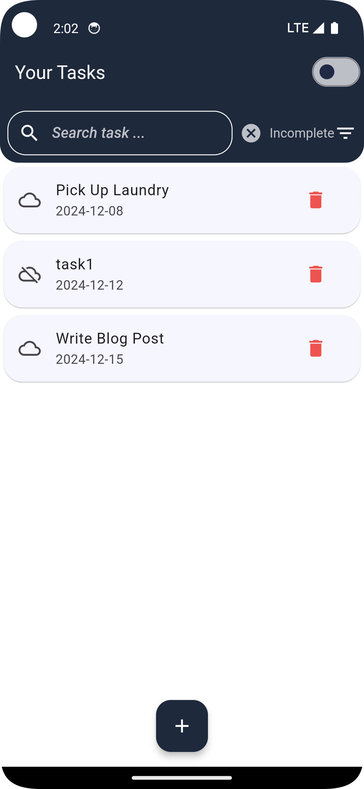

CheckMate By- Shubham choudhary
=========

CheckMate is a friendly to-do app designed to streamline tasks and enhance productivity. It offers both online and offline persistence, with powerful filtering and theming options to suit your workflow.

App Screen shots
--------
<p align="center">
  
  
  
</p>

Features
--------
- **Task Management**: Add, edit, and delete tasks effortlessly.
- **Data Persistence**:
  - **Online**: Store and fetch tasks using GitHub as a REST API database.
  - **Offline**: Use SharedPreferences for local storage of tasks.
- **Filtering Options**:
  - Filter tasks based on their status: **Completed** or **Incomplete**.
- **Themes**:
  - Switch between **Light Mode** and **Dark Mode** for better user experience.
- **State Management**: Powered by **Riverpod** for efficient and reactive state management.

App Structure
-------------

The app follows the **MVVM (Model-View-ViewModel)** architecture. Below is the folder structure:

```
lib/
├── models/
│   └── task_model.dart
├── services/
│   ├── local_services.dart       # Handles local storage using SharedPreferences
│   └── services.dart             # Manages online REST API interactions (GitHub)
├── utils/
│   ├── routes/
│   │   ├── navigation_provider.dart
│   │   └── route.dart            # Centralized routing logic
│   ├── themes/
│   │   ├── dimensions.dart       # App layout dimensions
│   │   ├── theme_notifier.dart   # Theme management with Riverpod
│   │   ├── themes.dart           # Light and Dark theme definitions
│   │   └── resources.dart        # Shared resources (colors, fonts, etc.)
├── viewmodels/
│   ├── animation_view_model.dart
│   ├── task_view_model.dart      # Business logic for online tasks
│   └── task_view_model_local.dart # Business logic for offline tasks
├── views/
│   └── home.dart                 # Main UI screen for task display
├── widgets/
│   └── animation.dart            # Shared animations
└── main.dart                     # App entry point
```

Technology Stack
----------------

- **Flutter**: Cross-platform UI development.
- **MVVM Architecture**: Ensures separation of concerns and modularity.
- **Riverpod**: A modern and simple state management solution.
- **GitHub REST API**: Used for online task storage and retrieval.
- **SharedPreferences**: Handles local, offline task persistence.

Installation and Setup
----------------------

1. Clone the repository
2. Navigate to the project directory
3. Install dependencies
4. Configure test acesss token in lib/services/services.dart - refer to the comment near access token variable.
5. Run the app
   
Usage
-----

- **Online Mode**: Ensure an internet connection to store and retrieve tasks using GitHub's REST API.
- **Offline Mode**: Tasks are saved locally using SharedPreferences when offline.
- **Filter Tasks**: Use filters to view tasks marked as **Completed** or **Incomplete**.
- **Switch Themes**: Toggle between **Light** and **Dark** mode in the settings.
- **State Management**: The app uses Riverpod to provide a seamless reactive experience.


# ToDoAPP_Checkmate
This repo contains the submission to the flutter intern assignment.
